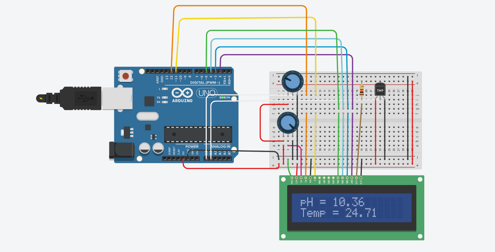

# Projeto: Medição de pH e Temperatura da Água com Arduino

## INTEGRANTES

- Luan Ramos RM: 558537
- Matheus Bortolotto RM: 555189
- Matheus Ricciotti RM: 556930

## Descrição

Este projeto visa a criação de um sistema de medição de pH e temperatura da água utilizando um Arduino. O sistema utiliza sensores para capturar os valores de pH e temperatura, e exibe esses valores em um display LCD. Além disso, os valores são enviados para o monitor serial para acompanhamento.

## Componentes Necessários

- 1x Arduino (Uno, Mega, etc.)
- 1x Display LCD 16x2
- 2x Potenciômetro (para simulação dos sensores de pH e temperatura)
- 1x Protoboard
- Jumpers

## Conexões

- **LCD 16x2:**

  - RS (pino 4) -> Pino digital 12 do Arduino
  - E (pino 6) -> Pino digital 11 do Arduino
  - D4 (pino 11) -> Pino digital 5 do Arduino
  - D5 (pino 12) -> Pino digital 4 do Arduino
  - D6 (pino 13) -> Pino digital 3 do Arduino
  - D7 (pino 14) -> Pino digital 2 do Arduino
  - VSS -> GND
  - VDD -> 5V
  - V0 -> Potenciômetro para controle de contraste
  - A -> 5V (retroiluminação)
  - K -> GND (retroiluminação)

- **Potenciômetros:**
  - Primeiro potenciômetro (simulando sensor de pH):
    - Um pino lateral -> 5V
    - Pino do meio -> A0 do Arduino
    - Outro pino lateral -> GND
  - Segundo potenciômetro (simulando sensor de temperatura):
    - Um pino lateral -> 5V
    - Pino do meio -> A1 do Arduino
    - Outro pino lateral -> GND

## Requisitos

- Arduino IDE
- Biblioteca LiquidCrystal (inclusa na IDE do Arduino)
- Placa Arduino compatível

## Dependências

Este projeto utiliza a biblioteca LiquidCrystal para controle do display LCD. Esta biblioteca já está incluída na IDE do Arduino.

## Imagens

